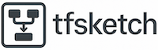
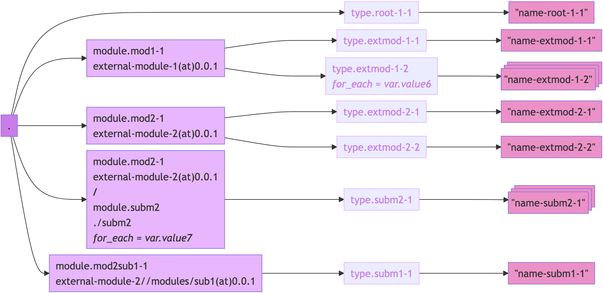

# tfsketch

[](https://goreportcard.com/report/github.com/keenbytes/tfsketch)



A lightweight tool that scans Terraform code for a specified resource type (e.g. `aws_iam_role`) and generates a Mermaid flowchart, along with a summary JSON file of the modules found. It supports scanning modules and nested sub-modules, as well as mapping external modules to local paths via a YAML file (e.g. a cloned Git repository). By default, it scans only one level of sub-directories, treating any `modules` directory as containing externally accessible sub-modules.

## Preview
Example diagram generated from tests/03-external-modules using tests/external-modules.yaml:



**Prerequisite**: Install [Mermaid CLI](https://github.com/mermaid-js/mermaid-cli) to convert Mermaid diagrams to SVG.

**Commands**:
```
./tfsketch gen -o tests/external-modules.yml tests/03-external-modules type tmp/03-external-modules.mmd
mmdc -i tmp/03-external-modules.mmd -o tmp/03-external-modules.mmd.svg
```

## Building
Run the following command to compile the binary:
```
go build .
```

## Running
Check below help message for `gen` command:

    Usage:  tfsketch gen [FLAGS] DIR RESOURCE_TYPE FILE
    
    Generate diagram
    
    Optional flags: 
      -d,    --debug             Enable debug mode
      -d2,   --include-filenames Display source filenames on the diagram
      -d1,   --only-root         Draw only the root directory
      -o,    --overrides FILE    YAML file mapping external modules to local paths

The command accepts three arguments:

* `DIR` – Path to the Terraform code to scan.
* `RESOURCE_TYPE` – The type of resource to search for (e.g. `aws_iam_role`).
* `FILE` – Output Mermaid chart file name.
