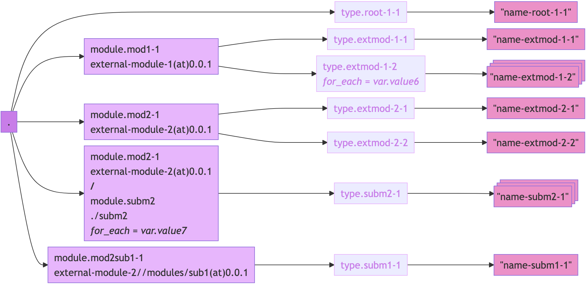

# tfsketch


A lightweight tool that scans Terraform code for a specified resource type (e.g. `aws_iam_role`) and generates a Mermaid flowchart, along with a summary JSON file of the modules found. It supports scanning modules and nested sub-modules, as well as mapping external modules to local paths via a YAML file (e.g. a cloned Git repository). By default, it scans only one level of sub-directories, treating any `modules` directory as containing externally accessible sub-modules.

## Preview
Example diagram generated from tests/03-external-modules using tests/external-modules.yaml:



**Prerequisite**: Install [Mermaid CLI](https://github.com/mermaid-js/mermaid-cli) to convert Mermaid diagrams to SVG.

**Commands**:
```
./tfsketch gen -o tests/external-modules.yml -t '^type$' tests/03-external-modules tmp/03-external-modules.mmd
mmdc -i tmp/03-external-modules.mmd -o tmp/03-external-modules.mmd.svg --configFile=tests/config.json
```

Check `tests` directory for more examples.

## Building
Run the following command to compile the binary:
```
go build .
```

## Running
Check below help message for `gen -h` command:
````
Generate diagrams based on Terraform files

Usage:
tfsketch gen [flags]

Flags:
-c, --cache string                 Path to directory where modules will be downloaded and cached
-d, --debug                        Enable debug mode
-a, --display-attributes string    Comma-separated resource attributes; the first found is used as the chart’s display name
-h, --help                         help for gen
-f, --include-filenames            Display source filenames on the diagram
-s, --minify                       Minify element names in the chart to save space
-m, --module                       Treat path as module and draw 'modules' sub-directory
-n, --name-regexp string           Regular expression to filter name of the resource (default "^.*$")
-r, --only-root                    Draw only root directory
--output string                Path to an output file (required)
-o, --overrides string             YAML file mapping external modules to local paths
--path string                  Path to directory with terraform code (required)
-e, --path-exclude-regexp string   Regular expression to exclude paths (default "^SillyName$")
-i, --path-include-regexp string   Regular expression to include paths (default "^.*$")
-t, --type-regexp string           Regular expression to filter type of the resource (default "^.*$")
````

## Motivation
**tfsketch** began as a small helper tool for navigating repositories packed with complex Terraform code, particularly in cases where specific resources—such as AWS IAM roles—needed to be refactored. It was also designed for situations where multiple repositories were being standardised to follow a consistent structure. By using the tool, it becomes easier to visualise repository contents and analyse their structure.

